<div align="center">
  
</div>

# Governed Universal Seed Kernel

A minimal governed kernel that bootstraps from a single profile, planner, governance, and tool gateway — with no model, GPU, network, environment secrets, or Docker required.

**Default production mode prohibits:**
- live self-modification
- direct shell access
- direct network access
- direct filesystem write outside approved runtime artifacts
- promotion from normal turn execution

## How to use Agent_X

Agent_X is intentionally **not** a finished assistant. You use it in two layers:

1) **This repository (L0):** the governed, replayable seed kernel and its proof suite.
2) **Your outer layer (L1+):** an external controller/coding agent/orchestrator that uses the evolution doctrine to evolve the repo (or to generate patch plans) and then runs the proofs.

Practically, the intended way to “use the agent” is:

- Start from the prompt packet at `DOCUMENTS/AGENT_X_EVOLUTION_PROMPT.md`.
- Feed that document (and the repo) to a strong coding agent / LLM, or implement it as a workflow in your own tooling.
- Have the external agent propose the **smallest safe** repository change toward your target capability, apply it (if authorized), and validate it using the proof commands.
- Keep L0 minimal; build additional runtime behavior in your outer layer or behind governed extension/profile boundaries.

If you just want to run the seed kernel as-is, use the commands below. If you want a “real agent”, use the prompt packet and build the outer layer on top of this kernel rather than trying to turn L0 into an autonomous self-evolving system.

## Quick start

```
make install     # Install minimal seed dependencies
make seed-boot   # Compile and boot the seed
make prove-seed  # Run canonical L0 seed proof
make run         # Run one default governed seed turn
make clean       # Remove generated runtime artifacts
```

## Non-goals of L0

L0’s purpose is to be a minimal, governed **kernel** that supports evolution using an inverse-scientific method: treat the target agent capability as the desired output, treat repository changes as candidate inputs, and use proofs/evidence to select the smallest safe next step.

Because it is a kernel, you are expected to build on top of it (in your outer layer and/or behind governed extension/profile boundaries). L0 is the initial, evidence-producing foundation in whatever direction the user wants to take the system.

L0 is only the governed seed runtime needed for:
- stable public entrypoint
- strict request/response contracts
- planner/governance/gateway execution path
- memory/evaluation/trace/checkpoint evidence
- profile-based specialization
- replayable proof of governed execution

Any future capability (agent, controller, model integration, external tool, network, shell, code evolution) must be added outside L0 or behind a separately governed extension boundary.

## Evolution (external agent)

This repository does **not** evolve itself.

Agent_X’s intended evolution loop is performed by an **external** coding/evolution agent (or a human using one) that:

- reads the repository authority files (seed invariants, acceptance checklists, extension boundary),
- selects the smallest safe, evidence-producing repository change toward a user-defined target agent,
- runs the proof commands, and
- reports what was actually changed and what evidence was actually observed.

The evolution doctrine is document-first and **advisory only**: it is meant to be used as a prompt packet for a strong LLM/coding agent, or engineered into your own tooling (for example with a workflow/orchestration framework like LangChain). How you execute the evolution prompts is intentionally left open so you can adapt it to your environment and constraints.

See:
- `DOCUMENTS/AGENT_X_AGENT_EVOLUTION_GUIDE_V11.md` (the primary evolution guide)
- `DOCUMENTS/AGENT_X_EVOLUTION_PROMPT.md` (a prompt/pseudocode framework derived from the guide)

## Visual Guide

The images below are stored in the same `DOCUMENTS/` directory as the logo. They explain the Agent_X evolution doctrine visually, from the high-level flow through final packaging.

### 1. High-Level Flow

This diagram summarizes the full evolution path: user request, intent understanding, L0 boundary check, evidence discovery, blueprint design, incremental planning, implementation, verification, documentation, and final packaging. The loop repeats until the change is verified.

<div align="center">
  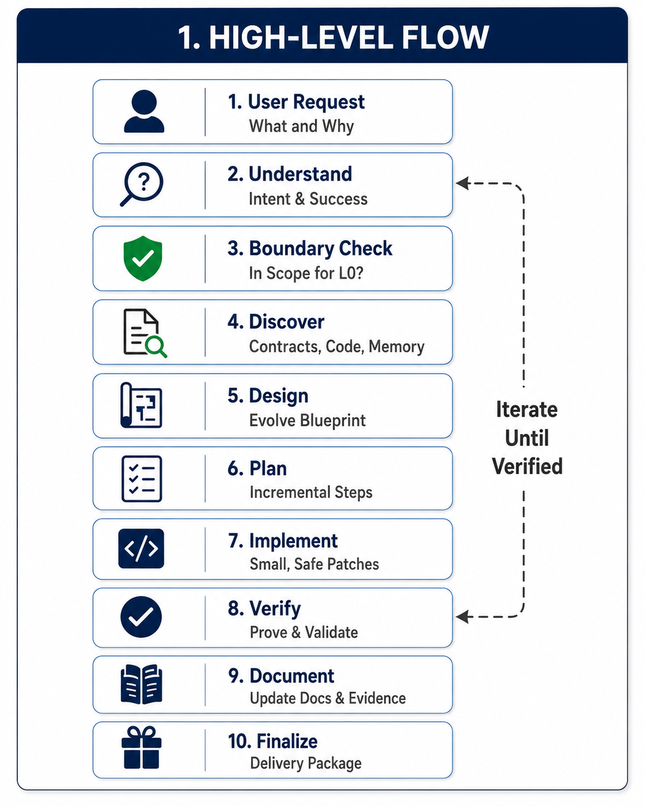
</div>

### 2. Authority Hierarchy

This diagram defines the evidence and authority order used by an external evolution agent. Commit evidence is highest authority, followed by current branch view, approved local extensions, foundation documents, user request, and other context or memory.

<div align="center">
  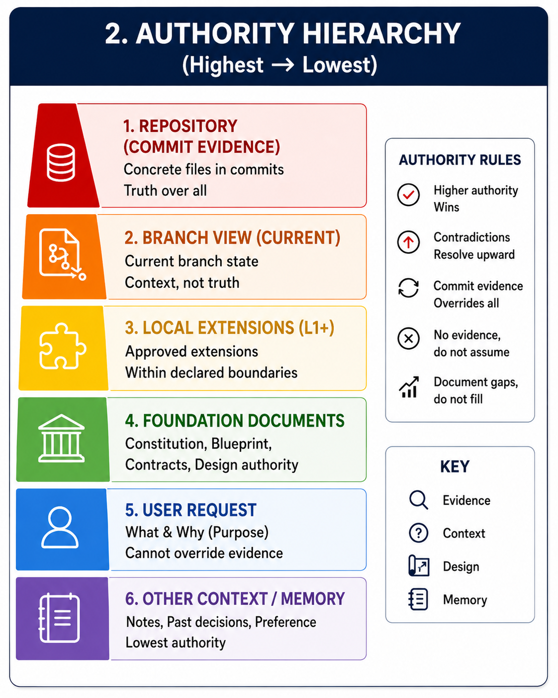
</div>

### 3. Source of Truth

This diagram reinforces that commit evidence comes first. If commit evidence is unavailable, the current branch view may be used. Missing files, missing tests, or missing proof must not be treated as evidence.

<div align="center">
  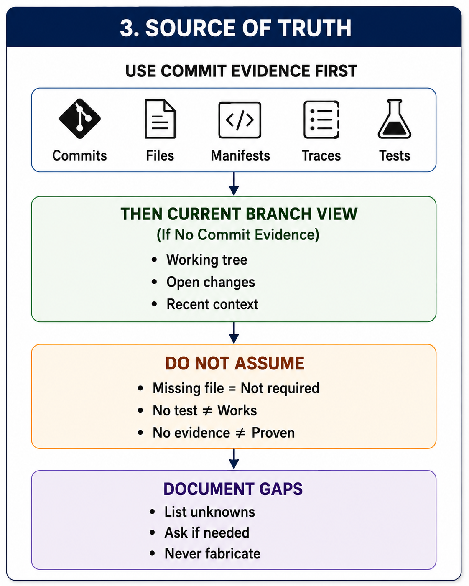
</div>

### 4. Pseudocode Overview

This diagram presents the evolution loop as pseudocode: understand the request, check boundaries, discover evidence, design the evolution, plan incremental steps, implement each step, verify it, record evidence, update documentation, and finalize the package.

<div align="center">
  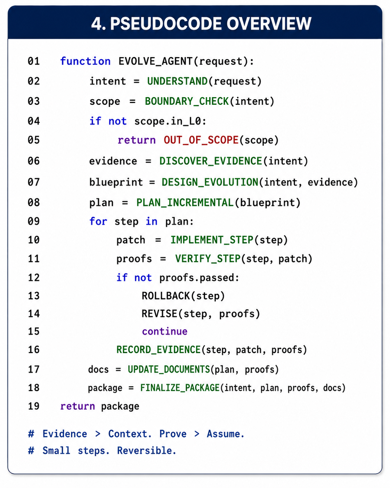
</div>

### 5. Phases and Key Inputs / Outputs

This diagram maps each evolution phase to its required inputs and expected outputs, helping an external coding agent avoid vague planning and produce traceable artifacts at each step.

<div align="center">
  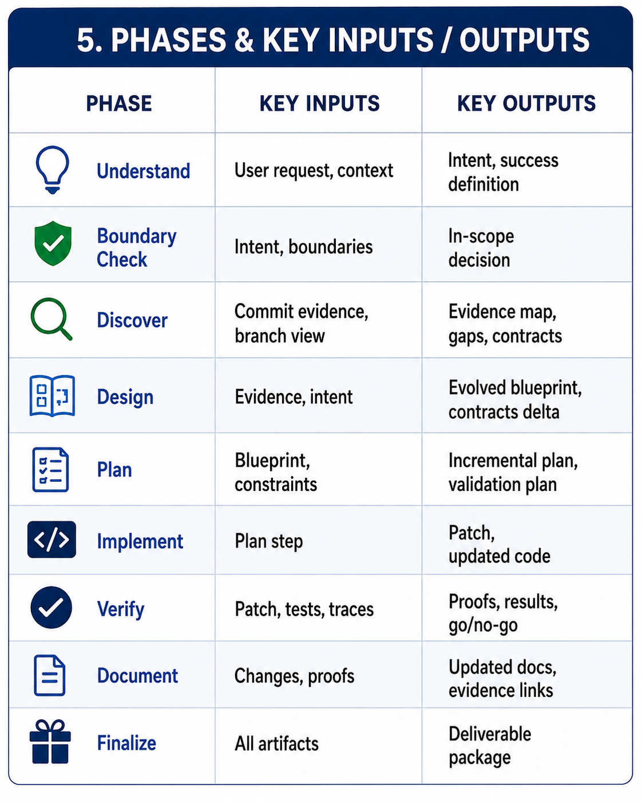
</div>

### 6. Incremental Implementation Loop

This diagram shows the small-patch loop: implement a safe patch, verify it, record evidence, review the result, and either continue or roll back, revise, and re-implement.

<div align="center">
  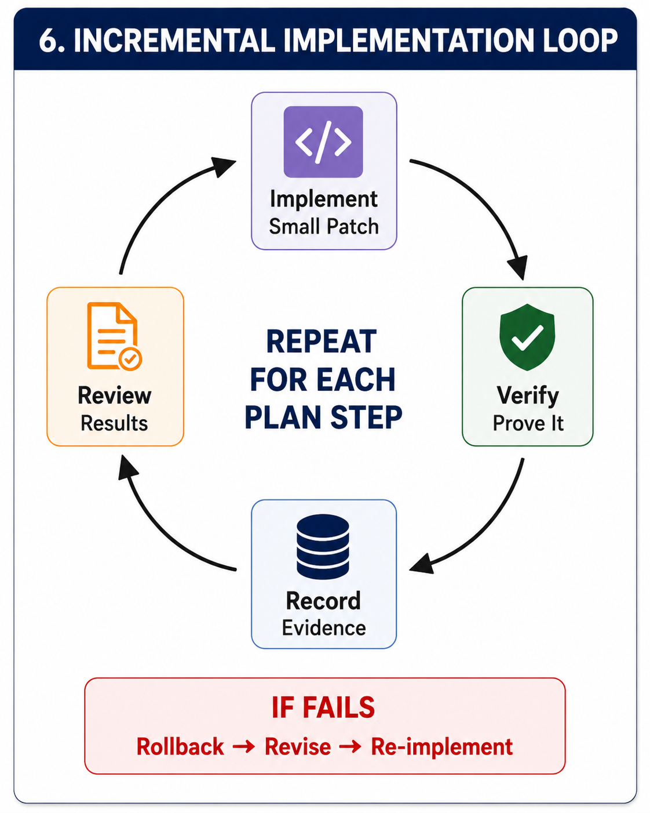
</div>

### 7. Evidence and Verification Pyramid

This diagram ranks evidence strength. Runtime proof and reproducible tests are stronger than static artifacts, while undocumented design assumptions are weakest. It also marks what to avoid: untested changes, untyped claims, ambiguous proof, and missing evidence.

<div align="center">
  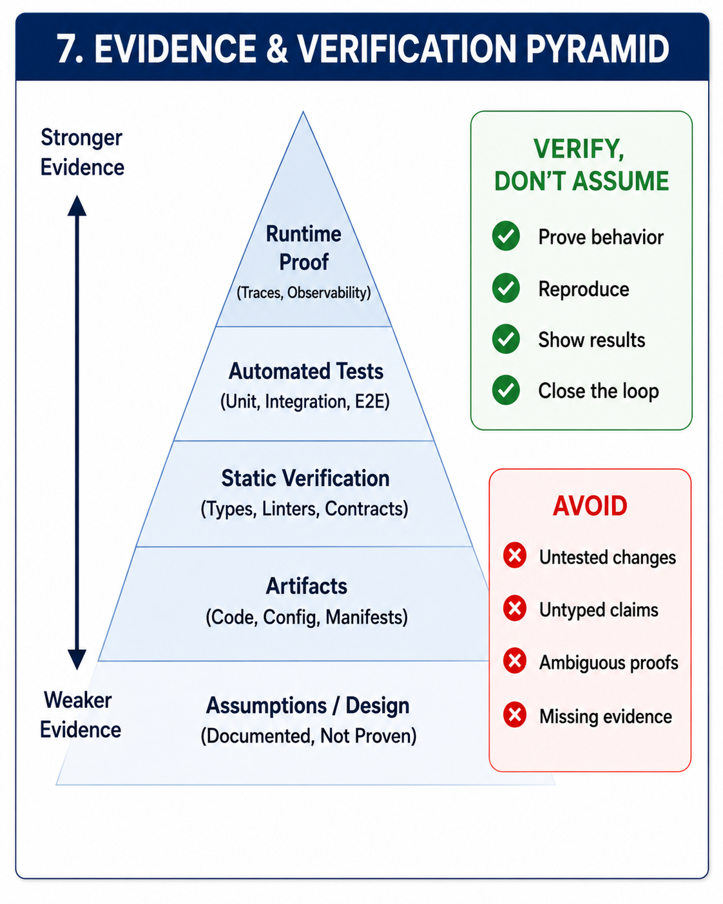
</div>

### 8. L0 Boundary Check

This diagram separates work that belongs inside the L0 seed from work that should be handed off or implemented outside L0. Core capabilities, contracts, architecture, and approved L1 extensions are in scope; new business domains, external products, infrastructure changes, and unapproved extensions are out of scope.

<div align="center">
  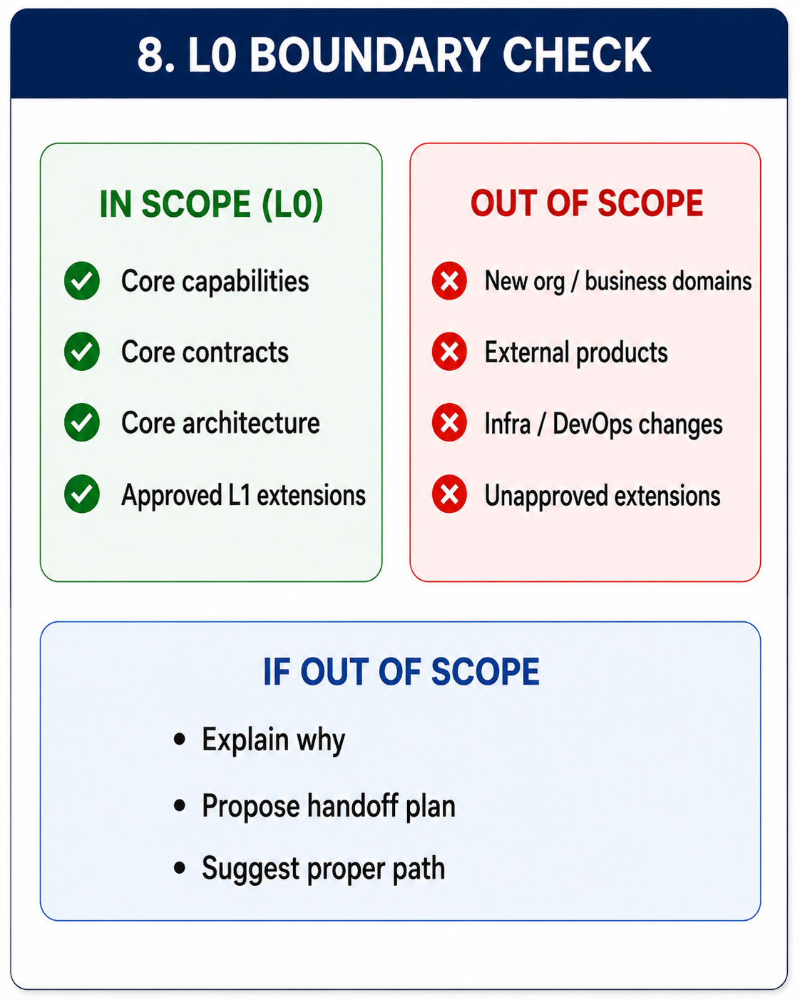
</div>

### 9. Final Deliverable Package

This diagram shows what a completed evolution package must contain: code changes, updated contracts, updated documentation, proofs and evidence, tests and results, an updated blueprint, and manifest or release notes.

<div align="center">
  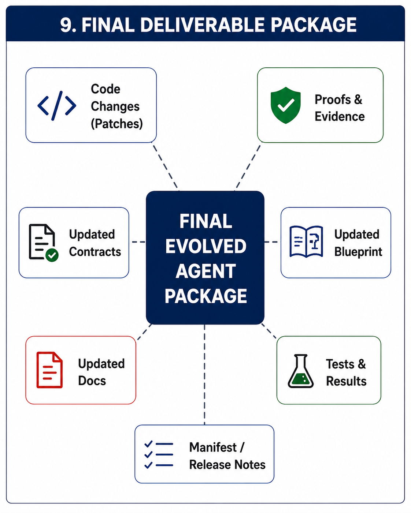
</div>

### 10. Decision Gates

This diagram captures the key go/no-go gates: scope, evidence, design, verification, and release readiness. Each gate determines whether the evolution proceeds, is revised, is handed off, or is finalized.

<div align="center">
  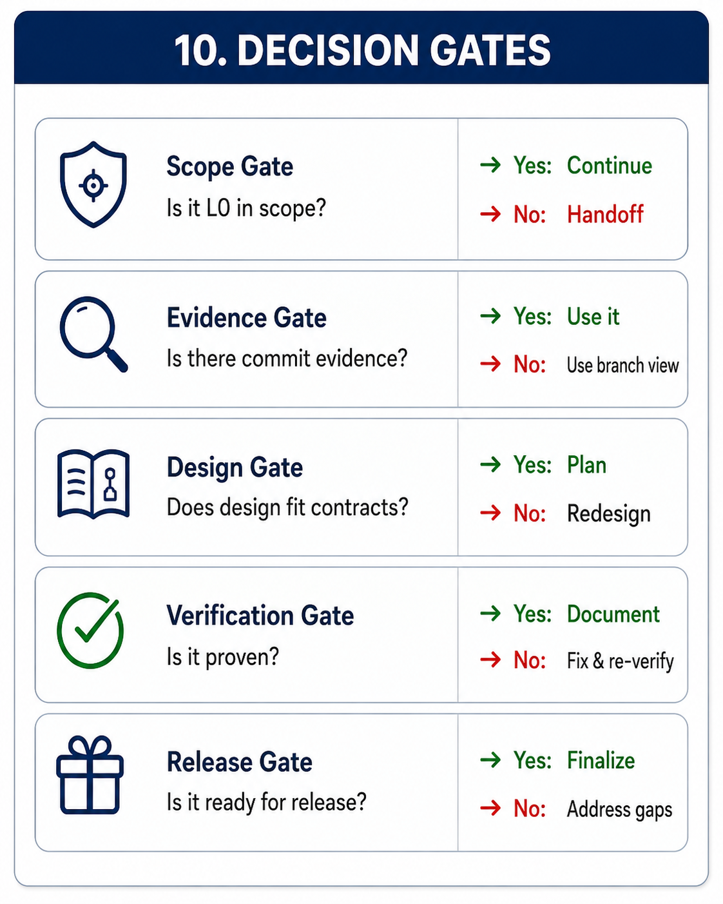
</div>

### 11. Document and Pseudocode Map

This diagram connects repository documents to the phases of the evolution pseudocode. It shows how the constitution, blueprint, contracts, memory, traces, checkpoints, evolution guide, manifest, and release notes support the workflow.

<div align="center">
  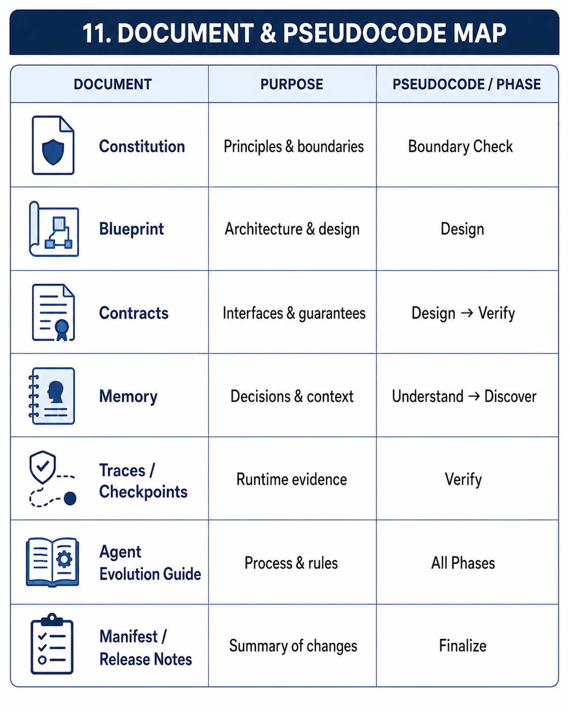
</div>

### 12. Quick Reference Rules

This diagram gives the short operational rules: evidence over everything, prove rather than assume, use small reversible steps, respect boundaries, document everything, and close the loop.

<div align="center">
  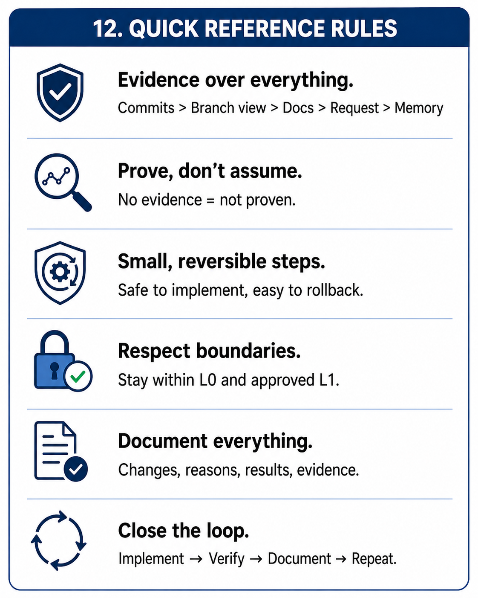
</div>

### 13. End-to-End Journey Summary

This diagram compresses the whole process into a single journey from the user request to the final documented package.

<div align="center">
  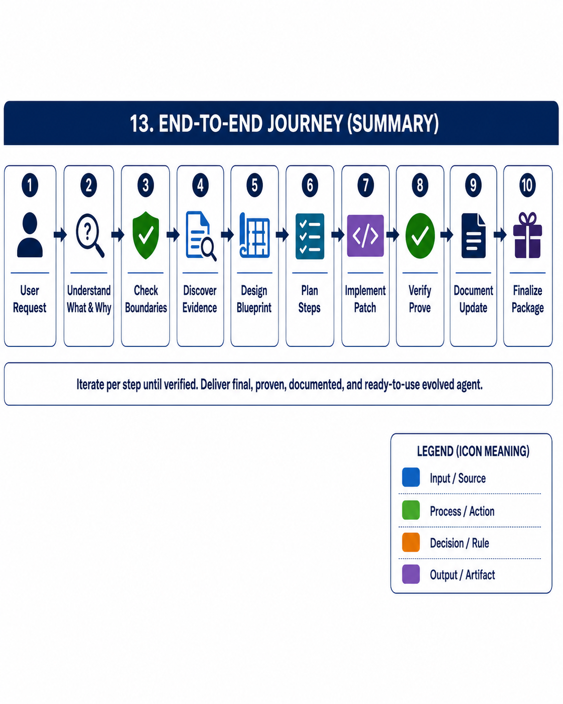
</div>

## Architecture

```
User Input → KernelService.run_turn()
  → PlannerPort (decides planned tool)
  → GovernancePort (allows/denies/requires-approval)
  → ToolGatewayPort (single execution choke point)
  → MemoryPort → EvaluationPort → TracePort → CheckpointPort
  → Output
```

Governance is checked after the planner selects a tool and before the gateway executes it.

## Commands

| Command | Purpose |
|---|---|
| `make install` | Install minimal seed dependencies |
| `make seed-boot` | Compile and boot the seed |
| `make prove-seed` | Run canonical L0 seed proof |
| `make run` | Run one default seed turn |
| `make build-seed` | Build seed package from manifest |
| `make clean` | Remove generated runtime artifacts |

## Documentation

| Document | Purpose |
|---|---|
| `SEED_PACKAGE_MANIFEST.yaml` | Seed-surface manifest |
| `CAPABILITY_MANIFEST.yaml` | Kernel capability declarations |
| `SEED_INVARIANTS.yaml` | Machine-readable invariant contract |
| `EXTENSION_ABI.md` | Allowed extension boundary |
| `EVOLUTION_ACCEPTANCE.md` | Acceptance checklist for external coding agents |
| `PUBLIC_CONTRACT_POLICY.md` | Public contract compatibility and versioning policy |
| `SEED_ACCEPTANCE.md` | Hard checklist for L0 seed acceptance |
| `DOCUMENTS/AGENT_X_AGENT_EVOLUTION_GUIDE_V11.md` | Advisory doctrine for evolving Agent_X using an external agent |
| `DOCUMENTS/AGENT_X_EVOLUTION_PROMPT.md` | Prompt/pseudocode packet for driving evolution with an external agent |
| `DOCUMENTS/agent_x_01_high_level_flow.png` | Diagram 1: High-level evolution flow |
| `DOCUMENTS/agent_x_02_authority_hierarchy.png` | Diagram 2: authority hierarchy |
| `DOCUMENTS/agent_x_03_source_of_truth.png` | Diagram 3: source-of-truth rule |
| `DOCUMENTS/agent_x_04_pseudocode_overview.png` | Diagram 4: pseudocode overview |
| `DOCUMENTS/agent_x_05_phases_inputs_outputs.png` | Diagram 5: phases and key inputs/outputs |
| `DOCUMENTS/agent_x_06_incremental_implementation_loop.png` | Diagram 6: incremental implementation loop |
| `DOCUMENTS/agent_x_07_evidence_verification_pyramid.png` | Diagram 7: evidence and verification pyramid |
| `DOCUMENTS/agent_x_08_l0_boundary_check.png` | Diagram 8: L0 boundary check |
| `DOCUMENTS/agent_x_09_final_deliverable_package.png` | Diagram 9: final deliverable package |
| `DOCUMENTS/agent_x_10_decision_gates.png` | Diagram 10: decision gates |
| `DOCUMENTS/agent_x_11_document_pseudocode_map.png` | Diagram 11: document and pseudocode map |
| `DOCUMENTS/agent_x_12_quick_reference_rules.png` | Diagram 12: quick reference rules |
| `DOCUMENTS/agent_x_13_end_to_end_journey.png` | Diagram 13: end-to-end journey summary |
| `DOCUMENTS/INVERSE_SCIENCE.txt` | Optional advisory method for external evolution agents; not part of the L0 runtime path |

## Optional Method Doctrine

`DOCUMENTS/INVERSE_SCIENCE.txt` describes an optional document-only reasoning method for external coding/evolution agents.

It may be used to choose small, evidence-producing repository changes by treating each proposed patch, test, profile, or documentation update as a candidate input and each proof result as an observation.

This document is advisory only. It adds no runtime behavior, tools, profiles, dependencies, public entrypoints, or L0 obligations.

## Verified Status

```bash
make seed-boot
make prove-seed
make run
```

The canonical proof suite verifies boot, governed turn execution, governance denial, governance-before-gateway ordering, evidence persistence, checkpoint replay, manifest closure, and phase order alignment.

## License

Proprietary — see [LICENSE](LICENSE).
